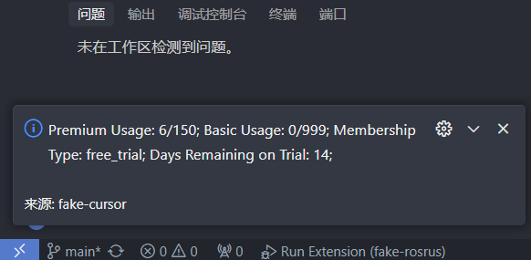
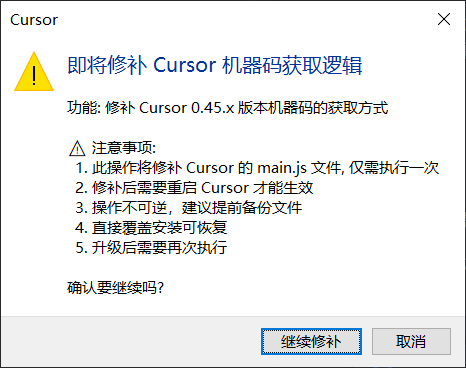
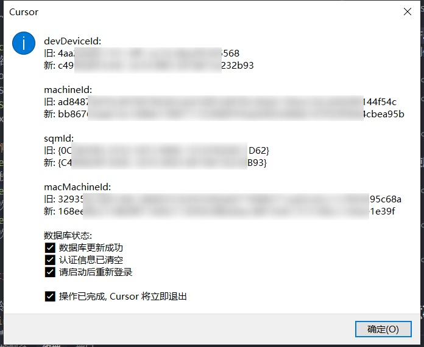
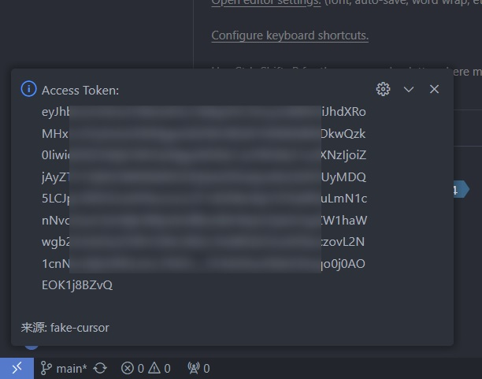

# Fake Cursor

一个用于重新生成 `Cursor` 设备 ID 和设置 `Access Token` 的 `Cursor` 扩展.

## 0.45.x 版本以上需要使用`Fake Cursor: Patch Machine ID`命令修补机器码获取逻辑。每次更新后需要重新Patch
## 建议使用0.46.x，0.47.x 暂时没有时间适配，各位欢迎大佬提PR

## 使用方法

1. 安装插件，按下 `Ctrl+Shift+P` (Windows/Linux) 或 `Cmd+Shift+P` (Mac) 打开命令面板
2. [0.45.x - 0.46.x版本]选择 `Fake Cursor: Patch Machine ID` 命令
3. 选择 `Fake Cursor: Regenerate Device ID` 命令
4. 根据提示完成操作
5. Cursor 将自动退出, 重启后生效
6. 去官网手动注册账号, 并登录

## 功能

- `Fake Cursor: Patch Machine ID`: 修补 Cursor 的机器码获取逻辑
- `Fake Cursor: Regenerate Device ID`: 重新生成设备 ID 并清空认证信息
- `Fake Cursor: Read Token`: 读取当前的 Access Token, 需登录Cursor后使用
- `Fake Cursor: Show Usage`: 显示 Cursor 的使用情况, 需登录Cursor后使用
- `Fake Cursor: Regenerate & Set Token`: 重新生成设备 ID 并设置 Access, 一般不使用
  > Token 可从 `cursor.sh` 网站 `Cook,es` 中的 `WorkosCursorSessionToken` 获取, 如
`user_01OJGGAOEIIYNGY4ISYAJT1U8R%3A%3AeyJhbGciOiJIU...` 中 `%3A%3A` 后面的 `eyJhbGciOiJIU...`
- 监控使用情况(Usage Monitor): 文件=>设置=>扩展=>Fake Cursor=>Usage Monitor=>在settings.json中配置, 参数如下:
  ```json
  "fake-cursor.usageMonitor": {
    "checkInterval": 60,  // 检查间隔(秒)
    "usageCountThreshold": 145,  // 使用次数阈值
    "usageRemainingThreshold": 5  // 剩余次数阈值
  },
  ```

## 配置选项

在 Cursor 设置中可以配置以下选项:

- `fake-cursor.storagePath`: 自定义配置文件所在文件夹的路径. 留空则使用默认路径: 
  - Windows: `%APPDATA%/Cursor/User/globalStorage`
  - macOS: `~/Library/Application Support/Cursor/User/globalStorage`
  - Linux: `~/.config/Cursor/User/globalStorage`

- **使用情况监控配置**:
  - `fake-cursor.usageMonitor.checkInterval`: 检查间隔（秒），最小为 20 秒
  - `fake-cursor.usageMonitor.usageCountThreshold`:
    使用次数阈值，达到该值时发出警告
  - `fake-cursor.usageMonitor.usageRemainingThreshold`:
    剩余次数阈值，达到该值时发出警告


## 注意事项

- 执行命令前会自动备份原有配置文件（`.backup` 后缀）
- 支持 Windows、Mac 和 Linux 系统
- 操作会清空现有认证信息, 请确保备份重要数据
- 修改后需要重启 Cursor 才能生效
- 如果配置文件不存在, 可以手动选择文件夹位置
- 修补机器码获取逻辑功能仅支持 Cursor 0.45.x 及以上版本，升级后需要重新执行
- 修补机器码获取逻辑后需要手动重启 Cursor 才能生效

## FAQ

- 推荐的版本？
  - 建议使用0.46.11版本，0.47.x版本暂时没有时间适配，各位欢迎大佬提PR。安装包指路: https://versions.ccursor.org/ 来源: @Crazy , 安装后再设置关闭自动更新

- 为什么需要重新生成设备 ID（Regenerate Device ID）?
  - 设备 ID 是 Cursor 的唯一标识, 重新生成后可以同一台设备上使用多个账号

- 为什么需要修补机器码获取逻辑（Patch Machine ID）?
  - Cursor 0.45.x 版本开始, 机器码获取逻辑发生了变化, 不修补会导致无法正常使用，**并且每次更新后需要重新修补一次**，并且暂仅支持0.45.x~0.46.x版本

- 为什么报错提示命令未找到?
  - 尝试重启 Cursor 或重新安装插件，如果问题依旧，请检查是否安装了其他同名插件。

- 为什么重置设备 ID 后，登录后使用几次账号从试用账号变成免费账号?
  - 未修复机器码获取逻辑，或cursor版本太高。

## 效果图

- `Fake Cursor: Show Usage`:
  - 
- `Fake Cursor: Patch Machine ID`:
  - 
- `Fake Cursor: Regenerate Device ID` 或 `Fake Cursor: Regenerate & Set Token`:
  - 
- `Fake Cursor: Read Token`:
  - 
- 监控使用情况:
  - 

## 开发

```bash
# 先把 package.json.zip 解压到当前目录
npm install
vsce package
```


## 免责声明

本扩展仅供学习和测试使用. 使用本扩展可能违反 Cursor 的服务条款,
请自行承担使用风险.


## 开源协议

本项目采用
[Creative Commons Attribution-NonCommercial 4.0 International License](https://creativecommons.org/licenses/by-nc/4.0/)
开源协议.

这意味着您可以:

- ✅ 复制、分发本项目
- ✅ 修改、演绎本项目
- ✅ 私人使用

但必须遵循以下规则:

- 📝 署名 - 标明原作者及修改情况
- 🚫 非商业性使用 - 不得用于商业目的
- 🔄 相同方式共享 - 修改后的作品需使用相同的协议
